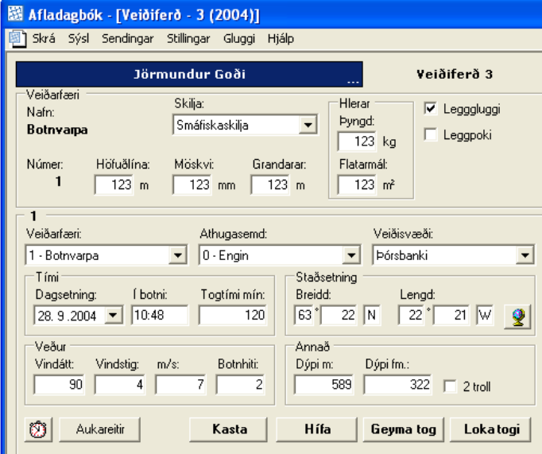

```{r setup, include=FALSE}
knitr::opts_chunk$set(echo = FALSE)
```

### Monitoring the activity of vessels at sea
Monitoring and mapping the activity of fishing vessels is an important requirement for fisheries management.

There are a number of "low tech" approaches:

 - Land-based interviews with fishermen
 - Fisheries observers
 - Logbooks
   + Catch (biomass, species composition)
   + Location on a map (e.g. using some type of grid)
   + GPS coordinates

<center></center>

---
### Monitoring the activity of vessels at sea

- The Icelandic "reitur" system.

<center></center>

---

### Vessel Monitoring Systems (VMS)
- Vessel Monitoring Systems systems that transmit the identity, position, and
  other data from vessels at sea.
- Vessels transmit continously at fixed rates (usually 1-2 hours)
- Data is usually transmitted through satellite communications (but also radio when close to land)
- Originally introduced to track the positions of vessels for safety purposes
- Also to monitor compliance with fishing regulations (e.g. fisheries closures).

<center></center>
---

### Automatic Identification System (AIS)

 - Designed to allow vessels to share identification, position and speed with nearby
   vessels.
 - Based on a dedicated VHF transceiver
 - Limited range: 30-60 Nm
 - Very low transmission cost -> high transmission rates (one each few seconds)
 - Vessels with AIS can be tracked by land-based stations placed along the coastlines.
 - Recent developments in satellite-based AIS allow tracking vessels in the high seas.

<center></center>

---

### Global Fishing Watch (GFW)
-  GFW: database of public available AIS data
-  Maps and data available at http://globalfishingwatch.org/

<center></center>

---

### VMS + AIS
 - AIS has limitations related to satellite coverage and interference

<center></center>
Global Fishing Watch

- In an optimal scenario AIS and VMS data can be merged to provide a comprehensive
   coverage of the activity of a vessel.
- Iceland: AIS + VMS data stored at 10-15 minutes intervals.

---

### Electronic Logbooks (ELBs)
ELBs are computer programs used to store and report information on catch, species composition, bycatch, etc.

- Data is recorded on a computer on board.  Ruggerized tablets or smartphones can also be used.
- Data is downloaded when the vessel is near the coastline.
  - Potential of transmission via cell phone networks
  - Data includes positional information
   + A single point for each fishing event
   + Automatic registration of points during fishing events.
- ELBs are used in several European countries, including Iceland.
---
### Electronic Logbooks (ELBs)

 .pull-left[
 
 ]

 .pull-right[
 
 ]
- Pros:
  - No need to "guess" when the vessel is fishing (if positional data is included)
  - Catch data is associated to fishing locations
- Cons:
  - Collection of data is not automatic


---

class: inverse, center, middle

## Applications of VMS data

---

### Applications of VMS data

- Beyond its immediate use (monitoring), VMS data is a valuable source of information

VMS data can be used to
- Describe the spatial distribution of fishing effort and of catch
- Evaluate changes in the distribution of effort through time
- Examine the behaviour of fishing vessels
- Evaluate the level of compliance with spatial closures
- Study the impact of fishing gear on sea bottom habitats
- Evaluate interactions between fishing and vulnerable marine habitats
---

### Tracking individual vessels
- VMS data can be used to track individual vessels.

<figure>
<center></center>
<center>Joo et al. 2011</center>
</figure>
---

### Mapping fishing effort
Stored VMS data can provide information on the overall fishing effort for certain period.
<figure>
<center></center>
</figure>
---

### Mapping the footprint of a fishery
- In Iceland we are mapping the footprint of the *Nephrops* (Norwegian lobster) fishery.
- Footprint: locations (cells) with at least 10 VMS records classified as fishing.
<figure>
<center></center>
</figure>
---

### Comparing fishing activity and fish biomass
- Location of fishing trawls derived from VMS data using neural networks
- Anchovy biomass derived from acoustic surveys

<figure>
<center></center>
<figcaption> Betrand et al. 2018 </figcaption>
</figure>
---

### Spatial distribution of catch
- If landings are reported with some accuracy, it is possible to associate catch to VMS records and map the catch.

<figure>
<center></center>
<figcaption> Gerritsen et al. 2012 </figcaption>
</figure>
---

### Catch per unit effort (CPUE)
- If we assume that the catch is distributed evently among VMS records, it is possible to map CPUE.
- Example: Mean CPUE of ling (*Molva molva*) off southern Iceland by the bottom trawl
fishery.
<figure>
<center></center>
</figure>


---

### Evaluating the impact of fishing on cold-water corals
- In the North Atlantic *Lophelia pertusa* is the main reef-forming coral
- *Lophelia* reefs are considered VMEs (Vulnerable Marine Ecosystems)

 .pull-left[
 <figure>
 <center></center>
 </figure>
 ]

 .pull-right[
 <figure>
 <center></center>
 </figure>
 ]

- *Lophelia* reefs are fragile and can be damaged by bottom trawlers.
---

### Evaluating the impact of fishing on cold-water corals
- We used VMS+ELB data to
  - Evaluate the distribution of fishing effort near coral areas
  - Design spatial closures to protect coral habitats
  - Minimise conflicts with the fishery


<center></center>

---

class: inverse, center, middle

## Introduction to spatial data

---


 ### What is spatial data?
 - Data referencing to events or objects in space (generally in 2D, could be  in 1D or
   3D) = coordinates
 - Sometimes the data are the locations themselves (e.g. locations of bottom trawls or
   coral reefs).
 - More often there is other data associated to each event or object (e.g. vessel id,
   catch, depth, species composition)
 - Spatial data can be classified as vector and raster (grid-based)

---

### Vector data: points

 - Vector data includes points, lines and polygons
 - Points: simply XY coordinates.

<center></center>

---

### Vector data: lines

 - Lines: coordinates are joined by paths in a specific order.
 - Networks of lines can have direction and connectivity.

<center></center>

---

### Vector data: polygons

 - Polygons: the last vertex joins the first one.
 - The order (clockwise, anticlockwise) indicates areas and holes or gaps.

<center></center>

---

### Example: trawls
 - The same information can be represented as different classes of spatial data.
 - This usually depends on the spatial scale.
 - For example, a trawl can be seen as a point, a line or a polygon.

<center></center>

---

### Rasters

 - A matrix of cells or pixels organized into rows and columns (or a grid).
 - Usually cells are square (but can also be rectangular or hexagonal)
 - May contains continuous (e.g. depth) or categorical (e.g.
   habitat type) data.
 - To define a raster you need to define:
   - The cell size (also known as grain or resolution)
   - The extent (raster size) or number of cells
   - The coordinate reference system
   - The origin

<center></center>

---

### Rasters
- Example: Surface chlorophyll estimated from satellite data

<center></center>

---

### Rasterization
 - The process of converting vector data into raster data is called "rasterization".
 - Rasterization is an important step when calculating fishing effort using VMS data.

 .pull-left[
 
 ]

 .pull-right[
 
 ]
---

class: inverse, center, middle

## Using VMS data

---


### Measures of fishing effort
Fishing effort: a measure of the amount of fishing in an area per unit of time

Measured as
 - Number of boats
 - Number of trawls, hooks or nets
 - Total length of nets
 - Hours trawled
 - Swept area
 - Number of hooks

---

### Fishing effort from VMS data

 .pull-left[
 - VMS data can be used to estimate fishing effort
   - Number of VMS points (eg. per km .yr)
   - Number of vessel tracks
   - Number of hours
   - Swept area (if we have information on trawl sizes)

 ]

 .pull-right[
<figure>
<center></center>
</figure>

 ]


---

### Fishing effort from VMS data

 .pull-left[
 - The simplest way to use VMS data to estimate and map fishing effort is to

   a) Identify which records correspond to fishing activities

   b) Prepare a grid and count the number of records in each cell.

- We are assuming that the number of records is proportional to the amount of fishing
- This works if the ping rate (number of transmissions per unit of time) is the same
- Problematic when mixing VMS and AIS data

 ]

 .pull-right[
<figure>
<center></center>
</figure>

 ]


---

### When is a vessel actively fishing?
- VMS data is transmitted continuously... but vessels do not fish all the time
- How we can identify when a vessel is fishing?
- Ancillary information
  - Logbooks
  - Bathymetry
- Most common approach: use a speed criteria, deciding on a range of speeds
- There are more sophisticated methods based on machine learning

<figure><center></center></figure>
---

### Speed criteria
- VMS data includes *instantaneous speed* (i.e. the speed of the vessel at the time of the transmission).
- Speed also can be computed from the distance and time between records, i.e. the *derived speed*
- In many cases, if we plot an histogram of the speed of a vessel we see a bimodal
  distribution
<figure>
<center></center>
</figure>

---

### Speed criteria
- We can assume that the lower mode corresponds to fishing activities, and the higher mode
  corresponds to steaming (i.e. moving)
- Very low speeds may not be fishing (e.g. for trawlers)
- *Beware of false positives!* Vessels can move slowly because of bad weather, proximity to
  a harbour, etc.
- The speed criteria may be different for different vessel sizes, fishing gears, and even
  for individual boats

<figure>
<center></center>
</figure>

---

### Selecting the resolution
- An important decision is the resolution of the grid (the size of cells)
- Smaller cells = more detail
- But... smaller cells = more processing time
- The minimum resolution possible is given by
  - The density of points
  - The recording rate
- 4 kts, 1 ping/h = 4 Nm between points

 .pull-left[
 <figure>
 <center></center>
 </figure>
 ]

 .pull-right[
 <figure>
 <center></center>
 </figure>
 ]

---

### Vessel tracks

 .pull-left[
- VMS records can be used to reconstruct the track of a vessel
- Useful for
  - Visualization of the activity of individual vessels
  - Examination of fishing patterns at smaller spatial resolutions
- The simplest assumption: linear movement between records
  - Becomes problematic when the recording rate is low
 ]

 .pull-right[
<figure>
<center></center>
<center>Joo et al. 2011</center>
</figure>

 ]

---

### Vessel tracks
- Is possible to use more complex methods like splines to produce more realistic tracks...
  but with higher computation time
- One example: cubit Hermite spline interpolation using vessel position, speed and heading

<figure>
<center></center>
<figcaption> Hintzen et al. 2010 </figcaption>
</figure>


---

### Rasterization of vessel tracks
- Tracks can also be rasterized, by identifying the cells "touched" by the track.
- Compute effort as tracks per cell per year
<figure>
<center></center>
</figure>
