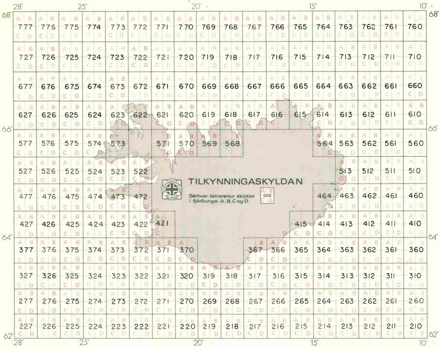
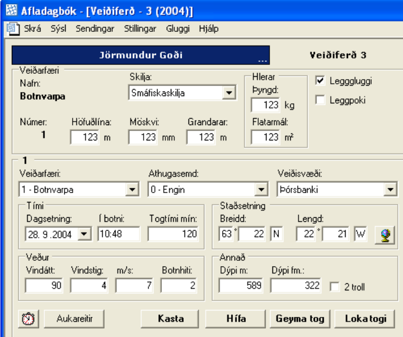
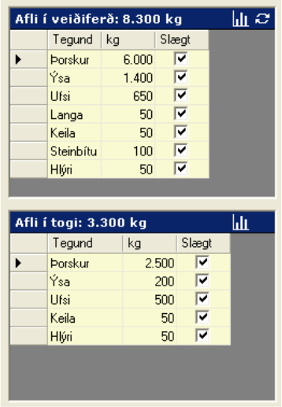

```{r setup, include=FALSE}
knitr::opts_chunk$set(echo = FALSE)
```

## Monitoring the activity of vessels at sea

"Low tech" approaches

- Interviews with fishermen
- Fisheries observers
- Logbooks
- Catch (biomass, species composition)
- Location on a map (gridded)
- GPS coordinates



## Vessel Monitoring Systems (VMS)
- Vessel Monitoring Systems systems that transmit the identity, position, and
  other data from vessels at sea.
- Data is usually transmitted through satellite communications (but also radio when close to land)
- Originally introduced to track the positions of vessels for safety purposes
- Also to monitor compliance with fishing regulations (e.g. fisheries closures).

## Automatic Identification System (AIS)
* Designed to allow vessels to share identification, position and speed with nearby
  vessels.
* Based on a dedicated VHF transceiver
* Limited range: 30-60 Nm
* Very low transmission cost -> high transmission rates (one each few seconds)
* Vessels with AIS can be tracked by land-based stations placed along the coastlines.
* Recent developments in satellite-based AIS allow tracking vessels in the high seas.

## Global Sea Watch


## Electronic Logbooks (ELBs)
ELBs are computer programs used to store and report information on

- Catch and species composition
- Bycatch, etc.

Data is stored on the computer on board.

  - Potential of transmission via cell phone networks
  - Positional information
   + A single point for each fishing event
   + Automatic registration of points during fishing events.
   + Multiple points during entire fishing trips
- ELBs are used in several European countries, including Iceland



