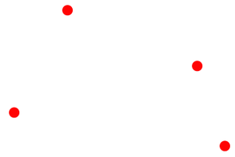
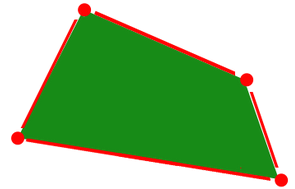
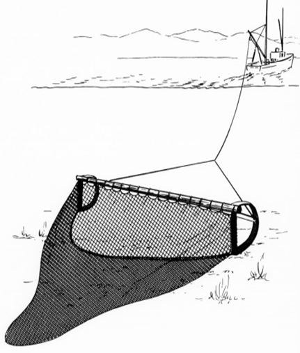

```{r setup, include=FALSE}
knitr::opts_chunk$set(echo = FALSE)
```
# Spatial data
## What is spatial data?
- Data referencing to events or objects in space (generally in 2D, could be  in 1D or
  3D) = coordinates
- Sometimes the data are the locations themselves (e.g. locations of bottom trawls or
  coral reefs).
- More often there is other data associated to each event or object (e.g. vessel id,
  catch, depth, species composition)
- Spatial data can be classified as vector and raster (grid-based)

## Vector data: points

- Vector data includes points, lines and polygons
- Vector data is comprised of vertices and paths.
- Points: simply XY coordinates.



## Vector data: lines

- Lines: coordinates are joined by paths in a specific order.
- Networks of lines can have direction and connectivity.


## Vector data: polygons

- Polygons: the last vertex joins the first one.
- The order (clockwise, anticlockwise) indicates areas and holes or gaps.



## Rasters

- A matrix of cells or pixels organized into rows and columns (or a grid).
- Usually cells are square (but can also be rectangular or hexagonal)
- May contains continuous (e.g. depth) or categorical (e.g.
  habitat type) data.
- To define a raster you need to define:
  - The cell size (also known as grain or resolution)
  - The extent (raster size) or number of cells
  - The coordinate reference system
  - The origin


## Example: trawls
- The same information can be represented as different classes of spatial data.
- This usually depends on the spatial scale.
- For example, a trawl can be seen as a point, a line or a polygon.



## Rasterization
- The process of converting vector data into raster data is called "rasterization"


## Rasterization: an example
[Add figure with 3 panels: some points, a grid, and the final raster with counts]


## Vectorization
- Raster data can also be converted into vector data.  This is called vectorization.

