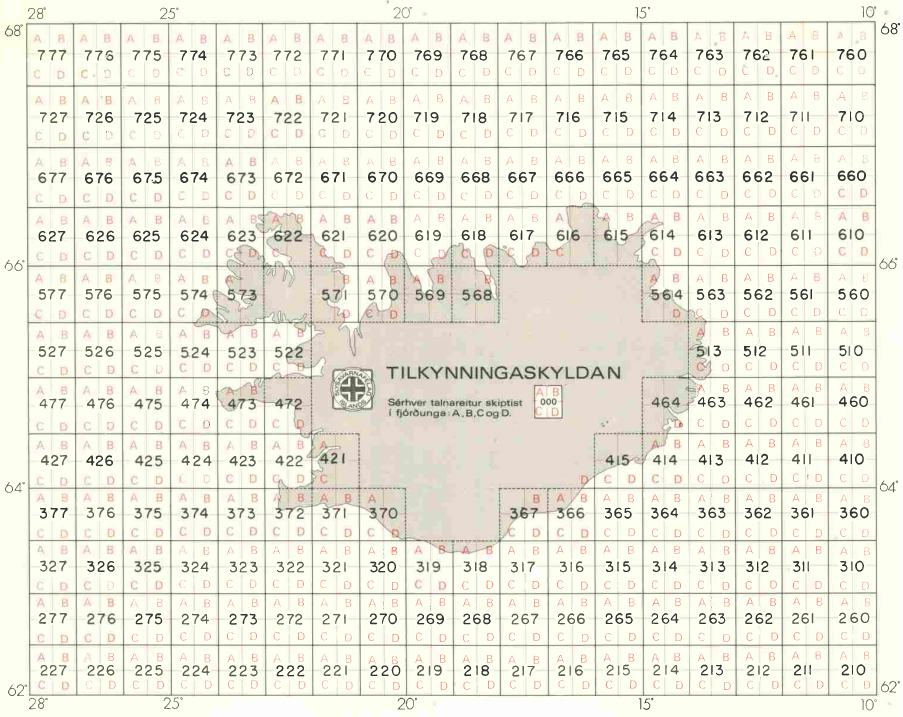
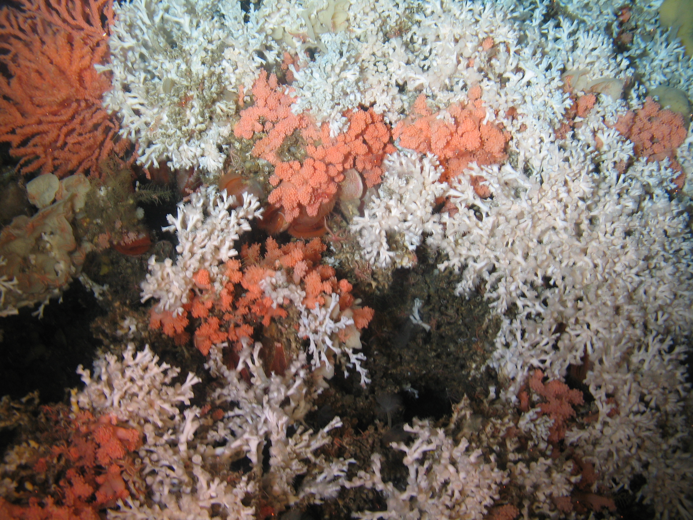
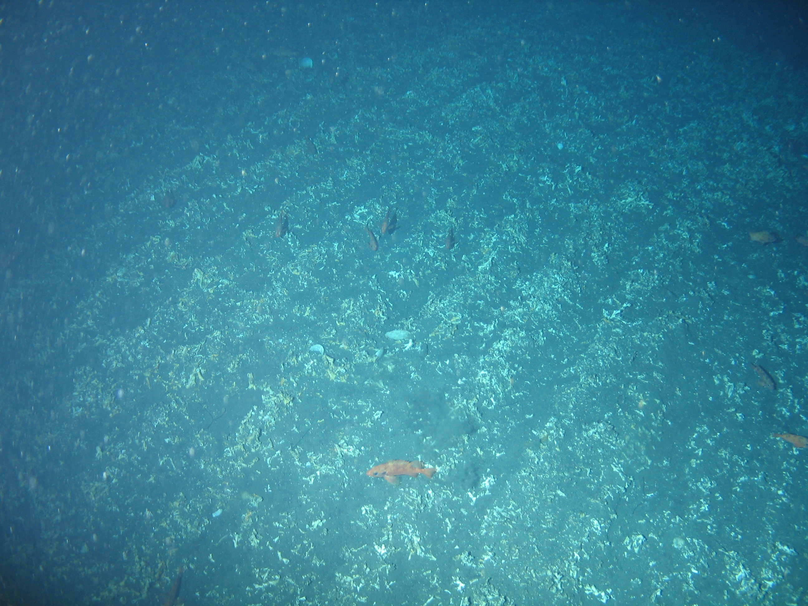

```{r setup, include=FALSE}
knitr::opts_chunk$set(echo = FALSE)
```

## Monitoring the activity of vessels at sea

"Low tech" approaches

- Interviews with fishermen
- Fisheries observers
- Logbooks
- Catch (biomass, species composition)
- Location on a map (gridded)
- GPS coordinates



## Vessel Monitoring Systems (VMS)
- Vessel Monitoring Systems systems that transmit the identity, position, and
  other data from vessels at sea.
- Data is usually transmitted through satellite communications (but also radio when close to land)
- Originally introduced to track the positions of vessels for safety purposes
- Also to monitor compliance with fishing regulations (e.g. fisheries closures).

VMS data can be used to
- Describe the spatial distribution of fishing effort and of catch
- Examine the behaviour of fishing vessels
- Evaluate the level of compliance with spatial closures
- Study the impact of fishing gear on sea bottom habitats

## Automatic Identification System (AIS)
* Designed to allow vessels to share identification, position and speed with nearby
  vessels.
* Based on a dedicated VHF transceiver
* Limited range: 30-60 Nm
* Very low transmission cost -> high transmission rates (one each few seconds)
* Vessels with AIS can be tracked by land-based stations placed along the coastlines.
* Recent developments in satellite-based AIS allow tracking vessels in the high seas.

## Global Sea Watch


## Electronic Logbooks (ELBs)
ELBs are computer programs used to store and report information on

- Catch and species composition
- Bycatch, etc.

Data is stored on the computer on board.

  - Potential of transmission via cell phone networks
  - Positional information
   + A single point for each fishing event
   + Automatic registration of points during fishing events.
   + Multiple points during entire fishing trips
- ELBs are used in several European countries, including Iceland


## Examples of uses of VMS data in Iceland and how this can be adapted for local use
   - Mapping effort of different fishing fleets/gears
   - Overlap with cold-water corals (protected features)
   - Identify Nephrops fishing areas and monitor the movement of the fleet

## Evaluating the impact of fishing on cold-water corals
- In the North Atlantic /Lophelia pertusa/ is the main reef-forming coral



- /Lophelia/ reefs are fragile and can be damaged by bottom trawlers.



- We used VMS+ELB data to
  - Evaluate the distribution of fishing effort near coral areas
  - Design spatial closures to protect coral habitats
  - Minimise conflicts with the fishery


## Measures of fishing effort
Fishing effort: a measure of the amount of fishing in an area per unit of time

Measured as
 - Number of boats
 - Number of trawls, hooks or nets
 - Total length of nets
 - Hours trawled
 - Swept area
 - Number of hooks

## Fishing effort from VMS data
 - VMS data can be used to estimate fishing effort
   - Number of fishing records per km-2.yr-1
   - Number of vessel tracks
   - Number of hours
   - Swept area (if we have information on trawl sizes)

## Fishing effort from VMS data
 - The simplest way to use VMS data to estimate and map fishing effort is to

   a) Identify which records correspond to fishing activities
   b) Prepare a grid (i.e. a mesh) and count the number of records in each cell or square.

- We are assuming that the number of records is proportional to the amount of fishing
- This works if the ping rate (number of transmissions per unit of time) is the same
- Problematic when mixing VMS and AIS data

## Speed criteria
- VMS data includes instantaneous speed
- Speed also can be computed from the distance and time between records
- In many cases, if we plot an histogram of the speed of a vessel we see a bimodal
  distribution
[Plot of vessel speed histogram]
- We can assume that the lower mode corresponds to fishing activities, and the higher mode
  corresponds to steaming (i.e. moving)
- But... very low speeds may not be fishing (e.g. for trawlers)
- Beware of false positives! Vessels can move slowly because of bad weather, proximity to
  a harbour, etc.
- The speed criteria may be different for different vessel sizes, fishing gears, and even
  for individual boats


## Selecting the resolution
- An important decision is the resolution of the grid (the size of cells)
- Smaller cells = more detail
- But... smaller cells = more processing time
- The minimum resolution possible is given by
  - The density of points
  - The recording rate
- 4 kts, 1 ping/h = 4 Nm between points

## Selecting the resolution
[Show example of the same data at 2/3 different resolutions]

## Vessel tracks
- VMS records can be used to reconstruct the track of a vessel
- The simplest assumption: linear movement between records
  - Becomes problematic when the recording rate is low
- Is possible to use more complex methods like splines to produce more realistic tracks...
  but with higher computation time
[Examples of tracks, linear and splines]

## Vessel tracks
- Useful for
  - Visualization of the activity of individual vessels
  - Examination of fishing patterns at smaller resolutions
  - Studying vessel "behaviour"
    [Example of Sofie's work with vessel behaviour and fish patchiness]

## Rasterization of vessel tracks
- Tracks can also be rasterized, by identifying the cells "touched" by the track.
- Compute effort as tracks per cell per year
[Example of my plots with VMS/ELB tracks]

## When is a vessel actively fishing?
- VMS data is transmitted continuously... but vessels do not fish all the time
- How we can identify when a vessel is fishing?
- Ancillary information
  - Logbooks
  - Bathymetry
- Most common approach: use a speed criteria, deciding on a range of speeds
- There are more sophisticated methods based on machine learning
